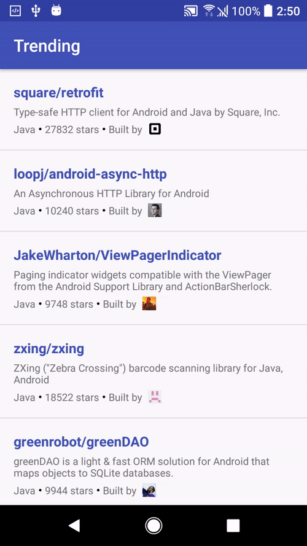

GithubTrending
====================================
Uses RxJava2, Retrofit to pull trending Github developer API.

Built with clean MVP architecture.

What does the UI look like?
----------------------------

